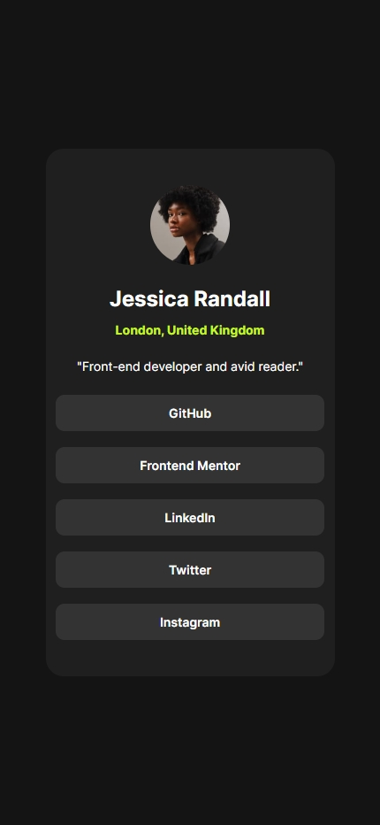

# Frontend Mentor - Social links profile solution

This is a solution to the [Social links profile challenge on Frontend Mentor](https://www.frontendmentor.io/challenges/social-links-profile-UG32l9m6dQ). Frontend Mentor challenges help you improve your coding skills by building realistic projects.

## Table of contents

- [Overview](#overview)
  - [The challenge](#the-challenge)
  - [Screenshot](#screenshot)
  - [Links](#links)
- [My process](#my-process)
  - [Built with](#built-with)
  - [What I learned](#what-i-learned)
  - [Continued development](#continued-development)
- [Author](#author)

## Overview

### The challenge

Users should be able to:

- See hover and focus states for all interactive elements on the page

### Screenshot




### Links

- Solution URL: [Frontendmentor](https://www.frontendmentor.io/solutions/social-links-profile---css-grid-clamp-and-focus-visible-states-EZdXiwhIa5)
- GitHub URL: [GitHub Repository](https://github.com/iianarmas/social-links-challenge)
- Live Site URL: [Vercel Deployment](https://social-links-challenge-tau.vercel.app/)

## My process

### Built with

- Semantic HTML5 markup
- CSS custom properties
- Flexbox
- CSS Grid
- Mobile-first workflow

### What I learned

Through this project, I reinforced my understanding of CSS Grid and custom properties for creating a responsive, centered card layout. I also practiced implementing interactive hover and active states for better user experience.

Key techniques I implemented:

```css
.link-button:hover {
  background-color: var(--accent-color);
  color: var(--primary-grey);
  font-weight: 700;
}

.link-button:active {
  transform: scale(1.02);
}
```

### Continued development

I want to continue focusing on:

- Improving accessibility features
- Refining responsive design techniques
- Exploring CSS animations and transitions further

## Author

- Frontend Mentor - [@iianarmas](https://www.frontendmentor.io/profile/iianarmas)
- GitHub - [@iianarmas](https://github.com/iianarmas)
